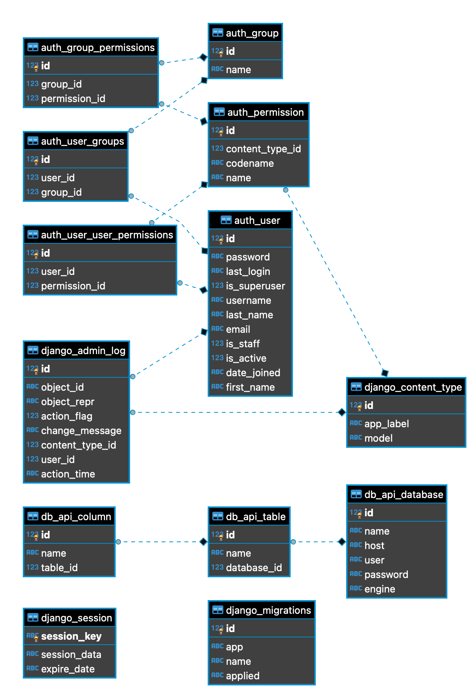

# Run the project
1. `cd db_extraction`
2. `docker-compose up`
3. `docker exec -it db_extraction_web_1 /bin/bash` in second terminal
4. `python manage.py migrate` inside docker container
5. reach app via `http://0.0.0.0:8000/api/`
6. tests can be run with `python manage.py test db_api` 

link to video: https://www.transfernow.net/dl/20240123VLMhxcMB 

## Answers to the questions
1. ### A high-level system diagram showing the different services in your system and how they interact with each other  
- Web Server that handles HTTP requests, processes them through Django views, interacts with the database, and sends responses.  
- Database where we actually storing the data 
- Django Backend where application logic resides. It handles business logic, communicates with the database, and serves data via endpoints
- Docker that serves application and its dependencies, providing consistency across environments

2. ### DB diagram

3. ### API documentation
That was added as part of the comments to django views, but I can duplicate it here:

3.1 Operations on Database instances.
- List Databases: GET /api/databases/
- Retrieve Database: GET /api/databases/{id}/
- Create Database: POST /api/databases/
- Update Database: PUT /api/databases/{id}/
- Delete Database: DELETE /api/databases/{id}/`

3.2 Operations on Table instances.
- List Tables: GET /api/tables/
- Retrieve Table: GET /api/tables/{id}/
- Create Table: POST /api/tables/
- Update Table: PUT /api/tables/{id}/
- Delete Table: DELETE /api/tables/{id}/
- Search Table: GET /api/tables/search_by_name/?name=nameToSearch

3.3 Operations on Column instances.
- List Columns: GET /api/columns/
- Retrieve Column: GET /api/columns/{id}/
- Create Column: POST /api/columns/
- Update Column: PUT /api/columns/{id}/
- Delete Column: DELETE /api/columns/{id}/

4. ### How would you implement authentication? 
By default django is using session based authentication, but the best decision would be to use a token based one. Also SAML can be used for some of the projects where we have few systems that are connected to each other. 

5. ### If you had to scale this system up to serve 1000s of requests per hour, how would you do it?
If to keep it short:  
5.1 caching  
5.2 orchestration using docker + kubernetes in order to do a load balancing  
5.3 async task distribution
5.4 Gunicorn as a server, not the one I've used for dev env 

6 ### If you had to be able to support Databases with 10,000 tables, how would your design change? What if you 
had to support databases with a million columns across 100,000 tables?
6.1 Proper indexing
6.2 Sharding
6.3 Queries optimization
6.4 Sometimes it's good to go with databases like mongo for heavy load systems
